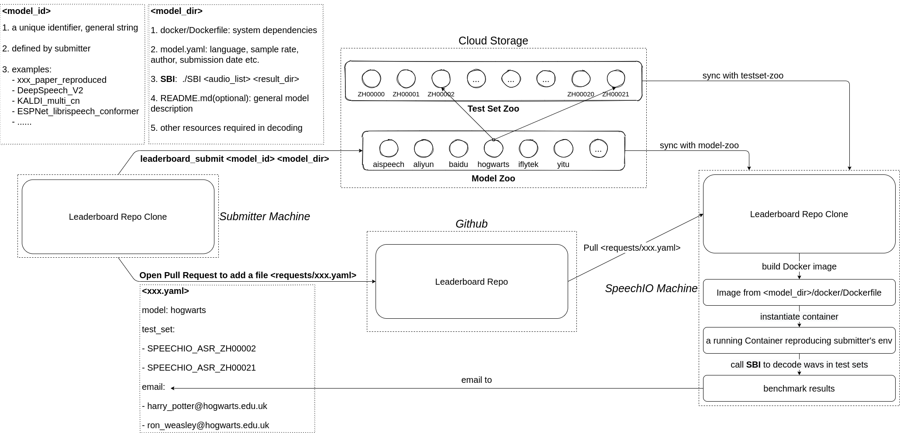

# How to submit your model to SpeechIO leaderboard
## Benchmarking Pipeline Overview


As above figure demonstrates, a benchmark cycle contains following steps:
1. submitter prepares their model on their local machine
2. submitter submits model dir to leaderboard model-zoo
3. submitter creates a benchmarking request by adding a benchmark config(yaml) via github pull request
4. SpeechIO invokes leaderboard pipeline on a benchmarking machine and emails final results back to submitter.

---

## Step 1. Prepare submission model dir

Conceptually, for leaderboard to re-produce and benchmark submitters' ASR system, submitters need to provide at least 3 things:
* system dependencies (operation system, softwares, libraries, packages)
* runtime resources (e.g. model, config, cloud-api credentials)
* a program that can decode local audio list

So the main purpose of leaderboard pipeline is to formalize above aspects down to a concrete specification. Let's start with `submission model dir`:
```
jiayu@ubuntu: tree ./sample_submission_model_dir

sample_submission_model_dir
├── docker
│   └── Dockerfile
├── model.yaml
├── README.md
└── SBI
```
**submitters should follow above file names and dir structures**, now let's explain this item by item.

---

### 1.1 `docker/Dockerfile`
Dockerfile serves as a specification of your ASR runtime environment, pipeline will build docker image to reproduce your system on local machine. Here, `runtime` can be a cloud-API client, or a  local ASR engine.

<details><summary> cloud-API ASR Dockerfile example </summary><p>

| model_id | Dockerfile |
| -- | -- |
| aispeech_api | [example](models/aispeech_api/docker/Dockerfile) |
| aliyun_api | [example](models/aliyun_api/docker/Dockerfile) |
| baidu_pro_api | [example](models/baidu_pro_api/docker/Dockerfile) |
| microsoft_api | [example](models/microsoft_api/docker/Dockerfile) |
| sogou_api | [example](models/sogou_api/docker/Dockerfile) |
| tencent_api | [example](models/tencent_api/docker/Dockerfile) |
| yitu_api | [example](models/yitu_api/docker/Dockerfile) |

</p></details>

<details><summary> local ASR Dockerfile example </summary><p>

| model_id | Dockerfile |
| -- | -- |
| sample_kaldi_model | [example](models/sample_kaldi_model/docker/Dockerfile) |

</p></details>

Besides your dependencies, submitter should always add **`Python3`** to Dockerfile, because leaderboard pipeline code requests python3 (this doesn't affect that your model can still depend on python2).

---

### 1.2 `model.yaml`
This config list required properties of your ASR system, example below:
```
date: 2021-04-05
task: ASR
language: zh
sample_rate: 16000
author: Jiayu
entity: SpeechIO
email: jerry.jiayu.du@gmail.com
```

* `date`: date of submission
* `task`: only support `ASR` for now
* `language`: lowercase language code (`ISO 639-1`) of this model, e.g `en`, `zh`
* `sample_rate`: sample rate. typically 8000(telephone) or 16000(other)
* `author`: model author/owner
* `entity`: model author/owner's entity
* `email`: model author/owner's contact

---

### 1.3 `README.md` (optional)
Although optional, we strongly suggest you provide more info about your model for community knowledge sharing, such as:
* number of parameters
* amount of training data
* training framework
* model structures & topology
* objective function
* optimizater
* front end feature type
* ...

---

### 1.4 `SBI`
`SBI` is a submitter implemented program that can decode audio files:
* `SBI` is an executable, could be shebanged `bash`, `python`, `perl` script, or `C/C++ binary`
* `SBI` will be invoked in submission model dir, so SBI can use relative path to refer to other programs, scripts and shared libraries inside model dir.
* `SBI` performs speech recognition to a list of audios
  ```
  ./SBI <input_audio_list> <result_dir>
  ```

* `input_audio_list` specifies a test set containing short utterances(less than 30 secs), all in standard 16k16bit-mono wav format. Line format and example:
  ```
  SPEECHIO_ASR_ZH00001__U_00001 /home/dataset/SPEECHIO_ASR_ZH00001/U_00001.wav
  SPEECHIO_ASR_ZH00001__U_00002 /home/dataset/SPEECHIO_ASR_ZH00001/U_00002.wav
  ...
  ...
  ```

* `SBI` can write/read arbitrary temporary files in <result_dir>, but final results need to be written to **`<result_dir>/raw_rec.txt`** with **`ASCII/UTF-8`** encoding, with format below:
  ```
  SPEECHIO_ASR_ZH00001__U_00001 I just watched the movie "The Pursuit of Happiness"
  SPEECHIO_ASR_ZH00001__U_00002 rock and roll like a rolling stone
  ...
  ...
  ```

* if recognition fails for an utterence, write a line with audio_uuid and empty recogntion result like this:
  ```
  SPEECHIO_ASR_ZH00001__U_00003  
  ```
* submitters don't need to worry about text normalization(upper/lowercase, punctuations, numbers, years etc), SpeechIO leaderboard will apply universal text normalization to every submission.

### 1.5 `Runtime Resources`
Runtime resources refers to `models`, `configs`, `cloud-api credentials` etc. Leaderboard pipeline has no constraints on how resources are organized, as long as they are **inside submission model dir**, `SBI` code is responsible and is supposed to know how to locate them properly.

For example:
```
jiayu@ubuntu: tree ./sample_model_directory

sample_model_directory
├── assets
    ├── asr.mdl
    ├── asr.cfg
    ...
...
└── SBI
```

then inside SBI code, SBI can always use `./assets/asr.{mdl,cfg}` to locate ASR resources.

---

### 1.6 Sample submission model dir

* a sample model dir of Cloud-API based ASR system:

  https://github.com/speechio/leaderboard/tree/master/models/aispeech_api

* a sample model dir of local ASR system in Kaldi:

  https://github.com/speechio/leaderboard/tree/master/models/sample_kaldi_model

---
### 1.7 Debugging and validating your submission model dir
Once you have prepared submission model dir following above specification, you need to validate everything works as expected. Here is what you can do:

1. make sure you can find a `MINI` test set in your local testset-zoo, i.e. `{leaderboard_git_repo}/datasets/MINI`
2. move prepared submission model to your local model-zoo
    ```
    mv {prepared_submission_model_dir} {leaderboard_git_repo}/models/{model_id_that_you_chose}
    ```
3. create a benchmark request(as described later in this guideline) under `{leaderboard_git_repo}/requests/mini_debug.yaml`

4. run a MINI benchmark:
    ```
    cd {leaderboard_git_repo}
    ./leaderboard_runner requests/mini_debug.yaml
    ```
5. check `{leaderboard_git_repo}/results/{CER,CHECK}`

This basically invokes a benchmarking pipeline locally on your machine, testing your model accuracy against MINI test set. If you can pass this validation, then congratulations, you have successfully made your ASR system reproducible, it's now safe to share and publish.

---

## Step 2: Submit your model
2.1 Install aliyun object-storage-service client (This needs to run only once)
```
# you should run this in leaderboard repo root
utils/install_oss.sh
```

2.2 Upload your model to leaderboard model-zoo
```
./leaderboard_submit  model_key  ~/work/prepared_local_model_dir
```
**`model_id`** is a unique identifier, used to refer to this model in future benchmarks.

We let submitters to decide their model id. It should be meaningful and unique, for example:
```
speechio_kaldi_pretrain
alphacep_vosk_en
interspeech_xxx_paper_reproduced
stanford_open_conformer
deepspeech_v1
word2vec_v2
```

---
## Step 3: Send a benchmark request via a pull request to leaderboard repo
Once you have your model submitted, you can open a PR to this github repo, which adds a request file to `requests` directory:

**`github.com/speechio/leaderboard/requests/give_a_name_for_your_benchmark_request.yaml`**

a sample request file contains following content:
```
date: 2021-04-05
requester: Jiayu
entity: SpeechIO
email: 
  - xxx@gmail.com
model: aliyun_api
test_set:
  - MINI
  - SPEECHIO_ASR_ZH00000
```
where:
* `date`: benchmark request date
* `model`: model key, specifying which model you want to benchmark
* `test_set`: test set id list, which test sets you want to benchmark with
* `email`: a list of email addresses to receive benchmark results

to lookup `model id` and `test_sets id`, refer to section 2 & section 3 [here](README.md)

Once we merge your submission pull request, the leaderboard pipeline will:
* init a docker runner to benchmark requested model with requested test sets
* email results to requester

## Contacts
Contact leaderboard@speechio.ai if you have further inquiries.
