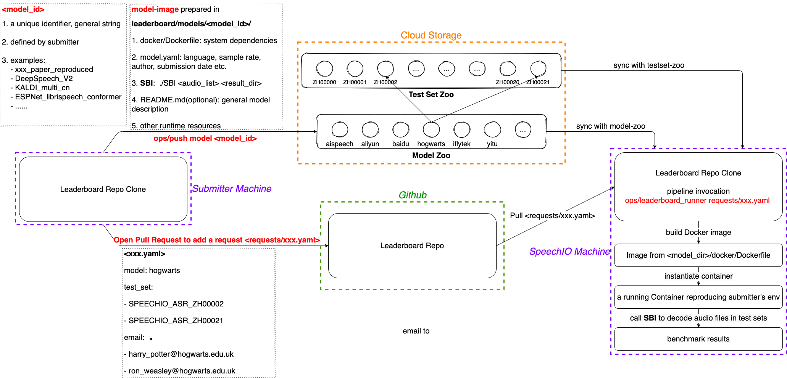

# How to submit your model to SpeechIO leaderboard
## Benchmarking Pipeline Overview


As above figure demonstrates, a benchmark cycle contains following steps:
1. submitter prepares their model following `model-image` specification
2. submitter submits model-image to model-zoo via leaderboard tool
3. submitter creates a benchmarking request by adding a benchmark config(yaml) via github pull request
4. SpeechIO invokes leaderboard pipeline on a benchmarking machine and emails final results back to submitter.

---

## Step 1. Prepare a model-image
A **model-image** is just an **ordinary directory** that includes a self-contained ASR system, internally with following files and structure:
```
jiayu@ubuntu: tree ./a_sample_model_image

a_sample_model_image
├── docker
│   └── Dockerfile
├── model.yaml
├── README.md
└── SBI
```
Now let's explain this item by item.

---

### 1.1 docker/Dockerfile
`docker/Dockerfile` should specify all dependencies of your ASR system, so a docker image can be built by leaderboard pipeline to reproduce your runtime envrionment. Here, `runtime` can be a cloud-API client, or a local ASR engine.

<details><summary> cloud-API ASR Dockerfile example </summary><p>

| model_id | Dockerfile |
| -- | -- |
| aispeech_api_zh | [example](models/aispeech_api/docker/Dockerfile) |
| aliyun_api_zh | [example](models/aliyun_api/docker/Dockerfile) |
| baidu_pro_api_zh | [example](models/baidu_pro_api/docker/Dockerfile) |
| microsoft_api_zh | [example](models/microsoft_api/docker/Dockerfile) |
| sogou_api_zh | [example](models/sogou_api/docker/Dockerfile) |
| tencent_api_zh | [example](models/tencent_api/docker/Dockerfile) |
| yitu_api_zh | [example](models/yitu_api/docker/Dockerfile) |

</p></details>

<details><summary> local ASR Dockerfile example </summary><p>

| model_id | Dockerfile |
| -- | -- |
| sample_kaldi_model | [example](models/sample_kaldi_model/docker/Dockerfile) |

</p></details>

**important note**: leaderboard pipeline code depends on python3, so submitter should always add **`Python3`** as an extra dependency in Dockerfile, even when your model depends on python2.

---

### 1.2 model.yaml
This config list required properties of your ASR system, example below:
```
date: 2021-04-05
task: ASR
language: zh
sample_rate: 16000
author: Jiayu
entity: SpeechIO
email: leaderboard@speechio.ai
```

* `date`: date of model creation
* `task`: this field must be `ASR` for now
* `language`: language code, lowercase [ISO 639-1](https://en.wikipedia.org/wiki/List_of_ISO_639-1_codes), e.g `en`, `zh`
* `sample_rate`: sample rate, typically 8000(telephone) or 16000(other)
* `author`: author/owner
* `entity`: author/owner entity
* `email`: author/owner email

---

### 1.3 README.md (optional)
Although this is not a mandatory requirement for model-image, we strongly suggest that you provide a summary about your model in this markdown, such as:

* number of parameters
* amount of training data
* front end feature type
* neural net structure & topology
* objective function
* optimizater
* ...

These kind of knowledge sharing is especially benefical to the speech community.

---

### 1.4 SBI
`SBI` is a submitter implemented `executable` for ASR benchmarking inference:
* **SBI** can be *C/C++ binary*, *bash, python* scripts (with shebang line such as `#!/usr/bin/env bash`) 
* **SBI** is always invoked in model-image dir, so its code can use relative path to refer to other resources inside model-image(such as models, configs, credentials, libraries, other programs/scripts)
* **SBI** should implement an audio-list ASR decoding:
  ```
  ./SBI <input_audio_list> <result_dir>
  ```

* where <input_audio_list> is a list of 16k16bit wavs(less then 30 secs), each line contains two fields <audio_id> and <abs_audio_path>, seperated by whitespace:
  ```
  SPEECHIO_ASR_ZH00001__U_00001 /home/dataset/SPEECHIO_ASR_ZH00001/U_00001.wav
  SPEECHIO_ASR_ZH00001__U_00002 /home/dataset/SPEECHIO_ASR_ZH00001/U_00002.wav
  ...
  ```

  there are no restrictions on <audio_id>, just keep in mind that audio_id string should be unique for each audio.

* **SBI** can write/read arbitrary temporary files in <result_dir>, but final results need to be written to **ASCII/UTF-8** encoded text file **<result_dir>/raw_rec.txt**:
  ```
  SPEECHIO_ASR_ZH00001__U_00001 I just watched the movie "The Pursuit of Happiness"
  SPEECHIO_ASR_ZH00001__U_00002 rock and roll like a rolling stone
  ...
  ```

* if recognition fails for an utterence, write a line with audio_id and empty recogntion result like this:
  ```
  SPEECHIO_ASR_ZH00001__U_00003  
  ```
* Once submitters can successfully debug and run SBI to decode their local audio list inside model-image dir, then prepared model-image should be good to work with leaderboard pipeline.  Submitters don't need to worry about text normalization(upper/lowercase, punctuations, numbers, years etc), WER/CER calculation etc.

---

### 1.5 Runtime Resources
Runtime resources refers to *models*, *configs*, *cloud-api credentials* etc. These resources can be freely organized by submitters, as long as they are **inside model-image**.  **SBI** code is responsible and is supposed to know how to locate them using relative path.

For example:
```
jiayu@ubuntu: tree ./a_sample_model_image

a_sample_model_image
├── assets
    ├── asr.mdl
    ├── asr.cfg
    ...
...
└── SBI
```

then inside SBI code, SBI can always use `./assets/asr.{mdl,cfg}` to locate runtime resources.

---

### 1.6 Sample model-image

* a sample model-image of Cloud-API ASR system:

  https://github.com/speechio/leaderboard/tree/master/models/aispeech_api_zh

* a sample model-image of local ASR system in Kaldi framework:

  https://github.com/speechio/leaderboard/tree/master/models/sample_kaldi_model

---
### 1.7 Validate prepared model-image with leaderboard pipeline on your local machine
1. make sure you can find `MINI` in your local testset-zoo, i.e. `leaderboard/datasets/MINI`
2. move prepared model-image to your local model-zoo
    ```
    mv <prepared_model_image> leaderboard/models/<your_model_id>
    ```

    **`model_id`** is a unique identifier, used to refer to this model in future benchmarks.

    We let submitters to decide their model id. It should be meaningful and unique, for example:
    ```
    speechio_kaldi_pretrain
    alphacep_vosk_en
    interspeech_xxx_paper_reproduced
    stanford_open_conformer
    deepspeech_v1
    word2vec_v2
    ```

3. create a benchmark request under `leaderboard/requests/mini_debug.yaml`, replace <your_model_id> field with your model_id:
    ```
    date: '2021-01-01'
    requester: xxx
    entity: xxx
    email: 
      - xxx@xxx.com
    model: <your_model_id>
    test_set:
      - MINI
    ```
4. run a MINI benchmark:
    ```
    # run this in leaderboard repo
    ops/leaderboard_runner requests/mini_debug.yaml
    ```

5. you can check `leaderboard/results/<***_your_model_id_***>/{CER,CHECK}`

If you can pass above local validation, then congratulations, you have successfully made your ASR system reproducible, it's now safe to share and publish.

---

## Step 2: Submit your model-image
2.1 Install aliyun object-storage-service client (one-time-only installation)
```
# run this in leaderboard repo
utils/install_aliyun_oss_client.sh
```

2.2 Move prepared model-image dir into local model-zoo
```
mv <prepared_model_image> leaderboard/models/<model_id>
```
This should have been done already if you did local validation.

2.3 Register your model-image at the end of `leaderboard/models/zoo.yaml`:
```
speechio_kaldi_multicn:
  url: oss://speechio-leaderboard/models/speechio_kaldi_multicn/
wenet_multi_cn:
  url: oss://speechio-leaderboard/models/wenet_multi_cn/
...
...
...
<model_id>:
  url: oss://speechio-leaderboard/models/<model_id>/
```

2.4 Upload your model-image to leaderboard model-zoo
```
ops/push model $model_id
```
This will upload prepared model-image from your local model-zoo to cloud model-zoo, so that SpeechIO/others can download/reproduce.
And you can always re-run above `ops/push` command to update your model-image in the cloud.

---

## Step 3: Send a benchmark request via a pull request to leaderboard repo
Once you have your model submitted, you can open a PR to this github repo, which adds a request file to `requests` directory:

**`github.com/speechio/leaderboard/requests/<your_benchmark_request>.yaml`**

a sample request can be found [here](requests/sample_request.yaml):
```
date: '2021-04-05'
requester: Jiayu
entity: SpeechIO
email: 
  - xxx@gmail.com
model: aliyun_api
test_set:
  - SPEECHIO_ASR_ZH00000
  - SPEECHIO_ASR_ZH00001
```
where:
* `date`: benchmark request date
* `model`: model id, specifying which model you want to benchmark
* `test_set`: test set id list, which test sets you want to benchmark with
* `email`: a list of email addresses to receive benchmark results

you can lookup `model` and `test_set` in section 2&3 of [README](README.md)

Once we merge your submission pull request, the leaderboard pipeline will:
* init a docker runner to benchmark requested model with requested test sets
* email results to requester

## Contacts
Contact leaderboard@speechio.ai if you have further inquiries.
