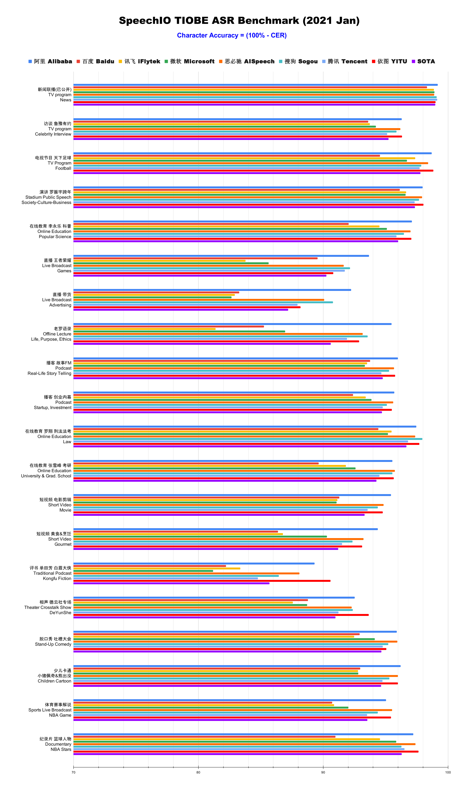

# SpeechIO ASR leaderboard
## What is this leaderboard all about?
Since the renaissance of Deep Learning, the field of Automatic Speech Recognition(ASR) has fundamentally changed.  Nowadays, people claim SOTA here and there(in research papers, in industrial PR articals).  But no one can actually quantitates "how these SOTA systems perform in real-life scenerios?".  People need an objective and comprehensive *RULER* to measure ASR systems precisely.

That's why SpeechIO leaderboard comes in, with emphasis on:
* comprehensive & biggest-ever test sets:
  - carefully curated by SpeechIO authers, crawled from publicly available sources(say Youtube, TV programs, Podcast etc)
  - covering various common scenarios and content domains that are familiar to the public.
  - and labelled by human annotators with great cautions and multi-iterations of quality checks.
* an open benchmarking platform:
  - a possibly simplest interface for submitters
  - a stable pipeline
  - an objective stand-point
  - open to anyone, to test and compare your models/algorithms with others.
* performances of top companies' ASR APIs & reproduced paper models are added into leaderboard as "SOTA" references. 

----------
## Test Sets Infomations
### English Leaderboard
  * TBD
  
### Chinese Leaderboard

| 场景     | 内容领域     | Scenario               | Topic Domain                                  | hours 时长 | Difficulty 难度(1-5) |
| ------ | -------- | ---------------------- | --------------------------------------------- | -------- | ------------------ |
| 新闻播报   | 时政       | TV News                | news & politics                               | 9        | ★                  |
| 访谈电视节目 | 名人工作、生活  | TV interview           | celebrity & film & music & daily              | 3        | ★★☆                |
| 专题电视节目 | 足球       | TV program             | Sports & Football & Worldcup                  | 2.7      | ★★☆                |
| 会场演讲   | 社会、人文、商业 | Stadium Public Speech  | Society & Culture & Business Trend            | 2.7      | ★★                 |
| 在线教育   | 科普       | Online Education       | Popular Science                               | 4.4      | ★★★                |
| 直播     | 游戏       | Live Broadcasting      | Game                                          | 1.6      | ★★★☆               |
| 直播     | 电商、美妆    | Live Broadcasting      | Advertising                                   | 0.9      | ★★★★☆              |
| 线下培训   | 段子、做人    | Offline lecture        | Life & Purpose & Ethics                       | 1.3      | ★★★★☆              |
| 播客     | 人生故事、见闻  | Podcast                | Ordinary Life Story Telling                   | 4.5      | ★★☆                |
| 播客     | 创业、产品、投资 | Podcast                | Startup & Enterprenuer & Product & Investment | 4.2      | ★★☆                |
| 在线教育   | 法律 法考    | Online Education       | Law & Lawyer Qualification Exams              | 3.4      | ★★☆                |
| 在线教育   | 考研 高校报考  | Online Education       | University & Graduate School Entrance Exams   | 3.4      | ★★★☆               |
| 短视频    | 电影剪辑     | Short Video            | Movie Cuts                                    | 1.8      | ★★★                |
| 短视频    | 美食、烹饪    | Short Video            | Food & Cooking & Gourmet                      | 1        | ★★★☆               |
| 评书     | 江湖、武侠    | Traditional Podcast    | Kongfu Fiction                                | 2.2      | ★★☆                |
| 相声     | 包袱段子     | Theater Crosstalk Show | Funny Stories                                 | 1        | ★★★                |
| 脱口秀    | 明星糗事     | Standup Comedy         | Celebrity Jokes                               | 1.8      | ★★☆                |
| 少儿动画   | 童话故事、日常  | Children Cartoon       | Fairy Tale                                    | 0.9      | ★☆                 |
| 体育赛事解说 | 篮球、NBA   | Sports Game Live       | NBA Game                                      | 0.7      | ★★★                |
| 纪录片    | 篮球明星、成长  | Documentary            | NBA Super Stars' Life & History               | 2.2      | ★★                 |


----------
## Leaderboard result as of 2021.Jan
  

----------
## How to submit your own benchmarking request?
To submit your model to leaderboard, you need to prepare 3 things:
1. a Dockerfile that delivers an implemention of Minimal Benchmarking Interface(MBI)
2. a model resource directory, containing your models, configs etc.
3. fill a submission form with your refered ID, title, submission data, model architecture etc.

detailed informations:
### Step 1: implement Minimal Benchmarking Interface(MBI) through a Dockerfile.
```
/app/speechio/leaderboard/MBI <input_audio_list> <output_recognition_result> 2> <log_file>
```
* we call above command `Minimal Benchmarking Interface(MBI)`, and this is the only concept you need to know to submit your benchmarking request.
* `/app/speechio/leaderboard/MBI` is a program provided by submitters through a `Dockerfile`. Besides the "MBI" program, Dockerfile should also handle MBI's dependencies(e.g., python? conda? pip requirements? kaldi? pytorch? tensorflow? espnet? or a github repo?). SpeechIO will build a Docker image accordingly, and instantiate a container to call above MBI in benchmarking pipeline.
* MBI can be `a bash/python script`(requires a shebang line at the beginning), `a C/C++ binary`, or even `a symbolic link to a program` with executable file permission.
* MBI can call any other program internally(say, MBI is a bash script calling multiple python programs, which call other C++ libraries)
* MBI accepts a list of audio files and output their recognition results.

_input_audio_list_ line format and example:
```
<audio_uuid> <audio_path>
```
```
TST_00001__U_00001 /home/dataset/TST_00001/U_00001.wav
...
...
...
```
* SpeechIO benchmarking pipeline will prepare _input_audio_list_ for each existing test set, and feed it into your MBI program.
* submitters can assume all audio files have standard 16k16bit mono(single channel) wav format


_output_recognition_result_ line format and example:
```
<audio_uuid> <speech_recognition_result>
```
```
TST_00001__U_00001 I just watched the movie "The Pursuit of Happiness"
...
...
...
```
* the output result file needs to be plain ASCII text or utf-8.
* for each line, the first field is audio's uuid, followed by a `tab` or `space`, and then the rest of the line is recognition result. If the recognition fails, keep recogntion result empty and start a new line.
* submitters don't need to worry about text normalization(upper/lowercase, punctuations, numbers, years etc), SpeechIO leaderboard will apply universal text normalization to every submission.

For log_file, it only captures stderr, for debugging purpose. Submitters can dump anything they like into log_file.

### Step 2: upload your model resources
* In China, we host submission model zoo on Aliyun OSS
* Overseas, AWS S3? 

### Step 3: fill submission meta info
we require a yaml format submission form, e.g.:
```
sbumission_id: "zXT8c9P"
submission_data: 2021-01-01
author: Jerry
entity: SpeechIO
contact: jerry.jiayu.du@gmail.com
description:
  - training_toolkit: kaldi
  - feature: 40 dim MFCC + speed_perturbation + spec_augment
  - model_architecture: CNN*2 + TDNN-F*10
  - num_params: 80M
  - training_loss: LF-MMI
```

## How long to wait for benchmarking results?
Normally 2~6 days

## Where to get benchmarking results?
TBD website? github repo?
