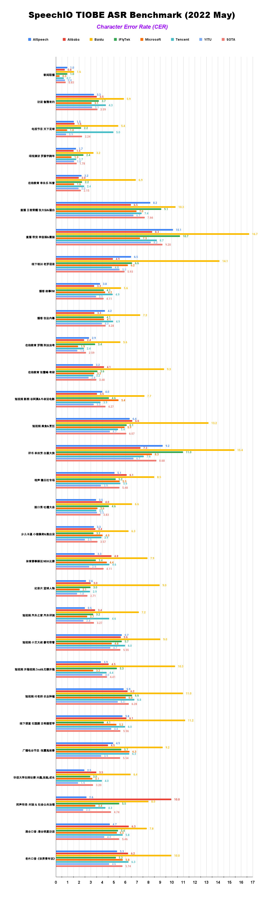

# SpeechColab ASR leaderboard
## 1. Overview

> "If you can’t measure it, you can’t improve it." -- *Peter Drucker*

Regarding to the current state of Automatic Speech Recognition(ASR), the term "State-Of-The-Art"(SOTA) is kind of *vague* in the sense that:
* For industry, there is no objective and quantative benchmark on how these commercial APIs perform in real-life scenarios, at least in public domain.
* For academia, it is becoming harder today to compare ASR models due to the fragmentation of research toolkits and ecosystems.
* How are academic SOTA and industrial SOTA related ?

---


As above figure shows, SpeechIO leaderboard serves as an ASR benchmarking platform, by providing 3 components:

1. **TestSet Zoo**: A collection of test sets covering wide range of speech recognition tasks

2. **Model Zoo**: A collection of models including commercial APIs and open-sourced pretrained models

3. **Benchmarking Pipeline**: a simple & well-specified pipeline to take care of data preparation / inference invocation / recognition post processing / error rate evaluation.

With SpeechIO leaderboard, _**anyone should be able to benchmark, reproduce, compare all these ASR systems locally**_

---

## 2. TestSet Zoo

### Academic Test Sets

| 已公开 <br> Unlocked | 编号 <br> TEST_SET_ID | 说明 <br> DESCRIPTION | 语言 <br> LANGUAGE |
| --- | --- | --- | --- |
| &check; | AISHELL1_TEST | test set of AISHELL-1 | zh |
| &check; | AISHELL2_IOS_TEST | test set of AISHELL-2 (iOS channel) | zh |
| &check; | AISHELL2_ANDROID_TEST | test set of AISHELL-2 (Android channel) | zh |
| &check; | AISHELL2_MIC_TEST | test set of AISHELL-2 (Microphone channel) | zh |


### SpeechIO Test Sets

SpeechIO test sets are carefully curated by SpeechIO authors, crawled from publicly available sources (Youtube, TV programs, Podcast etc), covering various well-known acoustic scenarios(AM) and topic domains(LM & vocabulary), labeled by payed professional annotators.

| 已公开 <br> Unlocked | 编号 <br> TEST_SET_ID | 名称 <br> Name |场景 <br> Scenario | 内容领域 <br> Topic Domain | 时长 <br> hours | 难度(1-5) <br> Difficulty  |
| --- | --- | --- | --- | --- | --- | --- |
| &check; |SPEECHIO_ASR_ZH00000| 接入调试集 <br> For leaderboard submitter debugging | 视频会议、论坛演讲 <br> video conference & forum speech | 经济、货币、金融 <br> economy, currency, finance | 1.0 | ★★☆ |
| &check; |SPEECHIO_ASR_ZH00001| 新闻联播 | 新闻播报 <br> TV News | 时政 <br> news & politics | 9 | ★ |
| &check; |SPEECHIO_ASR_ZH00002| 鲁豫有约 | 访谈电视节目 <br> TV interview | 名人工作/生活 <br> celebrity & film & music & daily | 3 | ★★☆ |
| &check; |SPEECHIO_ASR_ZH00003| 天下足球 | 专题电视节目 <br> TV program | 足球 <br> Sports & Football & Worldcup | 2.7 | ★★☆ |
| &check; |SPEECHIO_ASR_ZH00004| 罗振宇跨年演讲 | 会场演讲 <br> Stadium Public Speech | 社会、人文、商业 <br> Society & Culture & Business Trend | 2.7 | ★★ |
| &check; |SPEECHIO_ASR_ZH00005| 李永乐老师在线讲堂 | 在线教育 <br> Online Education | 科普 <br> Popular Science | 4.4 | ★★★ |
| &check; |SPEECHIO_ASR_ZH00006| 张大仙 & 骚白 王者荣耀直播 | 直播 <br> Live Broadcasting | 游戏 <br> Game | 1.6 | ★★★☆ |
| &check; |SPEECHIO_ASR_ZH00007| 李佳琪 & 薇娅 直播带货 | 直播 <br> Live Broadcasting | 电商、美妆 <br> Makeup & Online shopping/advertising | 0.9 | ★★★★☆ |
| &check; |SPEECHIO_ASR_ZH00008| 老罗语录 | 线下培训 <br> Offline lecture | 段子、做人 <br> Life & Purpose & Ethics | 1.3 | ★★★★☆ |
| &check; |SPEECHIO_ASR_ZH00009| 故事FM | 播客 <br> Podcast | 人生故事、见闻 <br> Ordinary Life Story Telling | 4.5 | ★★☆ |
| &check; |SPEECHIO_ASR_ZH00010| 创业内幕 | 播客 <br> Podcast | 创业、产品、投资 <br> Startup & Enterprenuer & Product & Investment | 4.2 | ★★☆ |
| &check; |SPEECHIO_ASR_ZH00011| 罗翔 刑法法考培训讲座 | 在线教育 <br> Online Education | 法律 法考 <br> Law & Lawyer Qualification Exams | 3.4 | ★★☆ |
| &check; |SPEECHIO_ASR_ZH00012| 张雪峰 考研线上小讲堂 | 在线教育 <br> Online Education | 考研 高校报考 <br> University & Graduate School Entrance Exams | 3.4 | ★★★☆ |
| &check; |SPEECHIO_ASR_ZH00013| 谷阿莫&牛叔说电影 | 短视频 <br> VLog | 电影剪辑 <br> Movie Cuts | 1.8 | ★★★ |
| &check; |SPEECHIO_ASR_ZH00014| 贫穷料理 & 琼斯爱生活 | 短视频 <br> VLog | 美食、烹饪 <br> Food & Cooking & Gourmet | 1 | ★★★☆ |
| &check; |SPEECHIO_ASR_ZH00015| 单田芳 白眉大侠 | 评书 <br> Traditional Podcast | 江湖、武侠 <br> Kongfu Fiction | 2.2 | ★★☆ |
| &cross; |SPEECHIO_ASR_ZH00016| 德云社相声演出 | 剧场相声 <br> Theater Crosstalk Show | 包袱段子 <br> Funny Stories | 1 | ★★★ |
| &cross; |SPEECHIO_ASR_ZH00017| 吐槽大会 | 脱口秀电视节目 <br> Standup Comedy | 明星糗事 <br> Celebrity Jokes | 1.8 | ★★☆ |
| &cross; |SPEECHIO_ASR_ZH00018| 小猪佩奇 & 熊出没 | 少儿动画 <br> Children Cartoon | 童话故事、日常 <br> Fairy Tale | 0.9 | ★☆ |
| &cross; |SPEECHIO_ASR_ZH00019| CCTV5 NBA 比赛转播 | 体育赛事解说 <br> Sports Game Live | 篮球、NBA <br> NBA Game | 0.7 | ★★★ |
| &cross; |SPEECHIO_ASR_ZH00020| 篮球人物 | 纪录片 <br> Documentary | 篮球明星、成长 <br> NBA Super Stars' Life & History | 2.2 | ★★ |
| &cross; |SPEECHIO_ASR_ZH00021| 汽车之家 车辆评测 | 短视频 <br> VLog | 汽车测评 <br> Car benchmarks, Road driving test | 1.7 | ★★★☆ |
| &cross; |SPEECHIO_ASR_ZH00022| 小艾大叔 豪宅带看 | 短视频 <br> VLog | 房地产、豪宅 <br> Realestate, Mansion tour | 1.7 | ★★★ |
| &cross; |SPEECHIO_ASR_ZH00023| 无聊开箱 & Zealer评测 | 短视频 <br> VLog | 产品开箱评测 <br> Unboxing | 2 | ★★★ |
| &cross; |SPEECHIO_ASR_ZH00024| 付老师种植技术 | 短视频 <br> VLog | 农业、种植 <br> Agriculture, Planting | 2.7 | ★★★☆ |
| &cross; |SPEECHIO_ASR_ZH00025| 石国鹏讲古希腊哲学 | 线下培训 <br> Offline lecture | 历史，古希腊哲学 <br> History, Greek philosophy | 1.3 | ★★☆ |
| &cross; |SPEECHIO_ASR_ZH00026| 张震鬼故事 | 广播节目 <br> Broadcasting Program | 鬼故事 <br> Horror Stories | 2.4 | ★★★ |
| &cross; |SPEECHIO_ASR_ZH00027| 华语辩论世界杯 | 辩论赛 <br> Debates Contest | 兴趣、技能、成长 <br> Hobby, Skill, Growth | 1.4 | ★★★ |
| &cross; |SPEECHIO_ASR_ZH00028| 时政现场同传 | 同声传译 <br> Simultaneous Translation | 时政、社会公共治理 <br> News & Events on Public Governance | 2.1 | ★★★☆ |
| &cross; |SPEECHIO_ASR_ZH00029| 港台明星访谈 <br> 周杰伦、曾志伟、张家辉、陈小春、周星驰 | 口音(港台) <br> Accent(HongKong & Taiwan) | 娱乐、生活、演艺 <br> Entertainment, Acting, Musics | 1.5 | ★★★☆ |
| &cross; |SPEECHIO_ASR_ZH00030| 世界青年说 | 口音(老外) <br> Accent(Foreigner) | 异国文化比较 <br> Cultural Difference | 2 | ★★★☆ |


To pull an **unlocked** test set from cloud dataset zoo to your local `leaderboard/datasets/<TEST_SET_ID>`:
```
ops/pull dataset <TEST_SET_ID>
```

---

## 3. Model Zoo

### Cloud API Models
API models are usually small (basically client programs), so we normally put them in this github repo.

| 已公开 <br> Unlocked | 编号 <br> MODEL_ID | 类型 <br> type | 模型作者/所有人 <br> model author/owner | 简介 <br> description | 链接 <br> Service URL |
| --- | --- | --- | --- | --- | --- |
| &check; | [aispeech_api_zh](models/aispeech_api_zh/) | Cloud API |思必驰 <br> AISpeech | 思必驰开放平台 | https://cloud.aispeech.com |
| &check; | [aliyun_api_zh](models/aliyun_api_zh/) | Cloud API |阿里巴巴 <br> Alibaba | 阿里云 | https://ai.aliyun.com/nls/asr|
| &check; | [baidu_pro_api_zh](models/baidu_pro_api_zh/) | Cloud API |百度 <br> Baidu | 百度智能云(极速版) | https://cloud.baidu.com/product/speech/asr |
| &check; | [iflytek_lfasr_api_zh](models/iflytek_lfasr_api_zh/) | Cloud API | 讯飞 <br> IFlyTek | 讯飞开放平台(转写) | https://www.xfyun.cn/services/lfasr |
| &check; | [microsoft_sdk_zh](models/microsoft_sdk_zh/) | Cloud API |微软 <br> Microsoft |Azure | https://azure.microsoft.com/zh-cn/services/cognitive-services/speech-services/ |
| &check; | [tencent_api_zh](models/tencent_api_zh/) | Cloud API |腾讯 <br> Tencent |腾讯云| https://cloud.tencent.com/product/asr |
| &check; | [yitu_api_zh](models/yitu_api_zh/) | Cloud API |依图 <br> YituTech |依图语音开放平台| https://speech.yitutech.com |

### Local Engine (Open-sourced Pretrained ASR Models)

Local models/engines are normally too large for github, so we store these models in cloud.

| 已公开 <br> Unlocked | 编号 <br> MODEL_ID | 类型 <br> type | 模型作者/所有人 <br> model author/owner | 简介 <br> description |
| --- | --- | --- | --- | --- |
| &check; | speechio_kaldi_multicn | pretrained model | Xingyu NA(那兴宇) | Kaldi multi_cn [recipe](https://github.com/kaldi-asr/kaldi/tree/master/egs/multi_cn/s5) |
| &check; | wenet_multi_cn | pretrained model | Binbin Zhang(张彬彬)@[wenet-e2e](https://github.com/wenet-e2e/) |  WeNet multi_cn [recipe](https://github.com/wenet-e2e/wenet/tree/main/examples/multi_cn/s0) |
| &check; | vosk_model_cn | batteries-included local engine | [alphacephei](https://alphacephei.com/vosk) | Chinese engine of [Vosk](https://alphacephei.com/vosk/models) |
| &check; | wenet_wenetspeech | pretrained model | Binbin Zhang(张彬彬)@[wenet-e2e](https://github.com/wenet-e2e/) |  WeNet wenetspeech [recipe](https://github.com/wenet-e2e/wenet/tree/main/examples/wenetspeech/s0) |

To pull an **unlocked** model from cloud model-zoo to your local `leaderboard/models/<MODEL_ID>`:
```
ops/pull model <MODEL_ID>
```

---

## 4. Benchmarking Pipeline
To submit your model to leaderboard and get it benchmarked over all test sets, follow this specification [How to submit](HOW_TO_SUBMIT.md)

Also you can pull unlocked models & test sets, and trigger benchmarking pipeline on your local machine via:
```
ops/leaderboard_runner requests/request.yaml
```
the content of `request.yaml` is described in above specification.

---
## 5. Ranking

### Ranking on unlocked test sets only
| Rank排名 | Model模型 | CER字错误率 | Submission date 提交时间 |
| --- | --- | --- | --- | 
| 1 | yitu_api_zh | 2.85 % | 2022.05 |
| 2 | aliyun_api | 3.03% | 2022.05 |
| 3 | microsoft_sdk_zh | 3.04% | 2022.05 |
| 4 | bilibili_api_zh | 3.09% | 2022.06 |
| 5 | aispeech_api_zh | 3.39% | 2022.05 |
| 6 | tencent_api_zh | 3.56% | 2022.05 |
| 7 | iflytek_lfasr_api_zh | 3.69% | 2022.05 |
| 8 | baidu_pro_api_zh | 6.64% | 2022.05 |

### Ranking on all SpeechIO test sets
| Rank排名 | Model模型 | CER字错误率 | Submission date 提交时间 |
| --- | --- | --- | --- |
| 1 | yitu_api_zh | 3.10 % | 2022.05 |
| 2 | bilibili_api_zh | 3.46 % | 2022.06 |
| 3 | microsoft_sdk_zh | 3.47% | 2022.05 |
| 4 | aispeech_api_zh | 3.63% | 2022.05 |
| 5 | aliyun_api | 3.81% | 2022.05 |
| 6 | iflytek_lfasr_api_zh | 4.05% | 2022.05 |
| 7 | tencent_api_zh | 4.06% | 2022.05 |
| 8 | baidu_pro_api_zh | 7.38% | 2022.05 |

---
## 6. Latest Leaderboard Report


---

## Contacts
Email: leaderboard@speechio.ai
