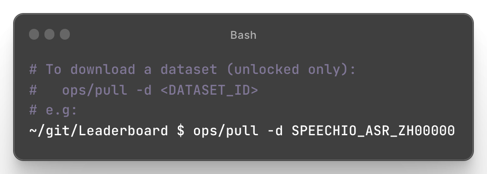
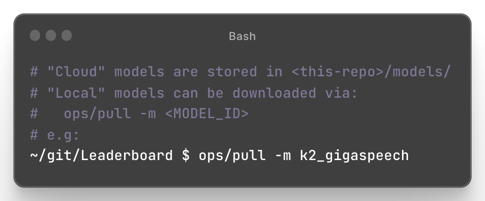

# SpeechColab ASR leaderboard


## 1. Overview

> "If you can’t measure it, you can’t improve it." -- *Peter Drucker*

SpeechIO leaderboard serves as an ASR benchmarking platform by providing 3 components:

1. **TestSet Zoo**: A collection of test sets covering wide range of speech recognition tasks & scenarios

2. **Model Zoo**: A collection of models including commercial APIs & open-sourced models

3. **Benchmarking Pipeline**: a simple & well-specified pipeline to take care of data preparation / recognition / post processing / error rate evaluation.

_**People should be able to easily benchmark, reproduce, examine ASR systems from each other**_


---

## 2. TestSet Zoo: `datasets/*`

<details><summary> Academic Test Sets (EN & ZH)  </summary><p>

| 已公开 <br> UNLOCKED | 编号 <br> DATASET_ID | 说明 <br> DESCRIPTION | 语言 <br> LANGUAGE |
| --- | --- | --- | --- |
| &check; | AISHELL1_TEST | test set of AISHELL-1 | zh |
| &check; | AISHELL2_IOS_TEST | test set of AISHELL-2 (iOS channel) | zh |
| &check; | AISHELL2_ANDROID_TEST | test set of AISHELL-2 (Android channel) | zh |
| &check; | AISHELL2_MIC_TEST | test set of AISHELL-2 (Microphone channel) | zh |
| &check; | ALIMEETING_EVAL_NEAR_FIELD | [AliMeeting](https://www.openslr.org/119/) | zh |
| &check; | ALIMEETING_TEST_NEAR_FIELD | [AliMeeting](https://www.openslr.org/119/) | zh |
| &check; | ALIMEETING_EVAL_FAR_FIELD | [AliMeeting](https://www.openslr.org/119/) | zh |
| &check; | ALIMEETING_TEST_FAR_FIELD | [AliMeeting](https://www.openslr.org/119/) | zh |
| &check; | LIBRISPEECH_TEST_CLEAN | "test_clean" set of [LibriSpeech](https://www.openslr.org/12) | en |
| &check; | LIBRISPEECH_TEST_OTHER | "test_other" set of [LibriSpeech](https://www.openslr.org/12) | en |
| &check; | TEDLIUM_RELEASE3_LEGACY_DEV | tedlium release 3, legacy dir dev set [TEDLium3](https://www.openslr.org/51/) | en |
| &check; | TEDLIUM_RELEASE3_LEGACY_TEST | tedlium release 3, legacy dir test set [TEDLium3](https://www.openslr.org/51/) | en |
| &check; | GIGASPEECH_V1.0.0_DEV | dev set of [GigaSpeech](https://github.com/SpeechColab/GigaSpeech) | en |
| &check; | GIGASPEECH_V1.0.0_TEST | test set of [GigaSpeech](https://github.com/SpeechColab/GigaSpeech) | en |
| &check; | VOXPOPULI_V1.0_EN_DEV | dev set of [VoxPopuli](https://github.com/facebookresearch/voxpopuli) | en |
| &check; | VOXPOPULI_V1.0_EN_TEST | test set of [VoxPopuli](https://github.com/facebookresearch/voxpopuli) | en |
| &check; | VOXPOPULI_V1.0_EN_ACCENTED_TEST | accented test set of [VoxPopuli](https://github.com/facebookresearch/voxpopuli) | en |
| &check; | COMMON_VOICE_V11.0_DEV | dev set of [Common Voice](https://commonvoice.mozilla.org/en/datasets) | en |
| &check; | COMMON_VOICE_V11.0_TEST | test set of [Common Voice](https://commonvoice.mozilla.org/en/datasets) | en |

</p></details>

<details><summary> SpeechIO Test Sets (ZH) </summary><p>

```
SpeechIO test sets are carefully curated by SpeechIO authors, crawled from publicly available sources (Youtube, TV programs, Podcast etc), covering various well-known scenarios and topics, transcribed by payed professional annotators.
```

| 已公开 <br> UNLOCKED | 编号 <br> DATASET_ID | 名称 <br> NAME | 场景 <br> SCENARIO | 内容领域 <br> TOPIC | 有效时长 <br> DURATION (HOURS) | 难度(1-5) <br> DIFFICULTY  |
| --- | --- | --- | --- | --- | --- | --- |
| &check; |SPEECHIO_ASR_ZH00000| 调试集 <br> for debugging | 视频会议、论坛演讲 <br> conference & speech | 经济、货币、金融 <br> economy, currency, finance | 1.0 | ★★☆ |
| &check; |SPEECHIO_ASR_ZH00001| 新闻联播 | 新闻播报 <br> TV News | 时政 <br> news & politics | 9 | ★ |
| &check; |SPEECHIO_ASR_ZH00002| 鲁豫有约 | 访谈电视节目 <br> TV interview | 名人工作/生活 <br> celebrity & film & music & daily | 3 | ★★☆ |
| &check; |SPEECHIO_ASR_ZH00003| 天下足球 | 专题电视节目 <br> TV program | 足球 <br> Sports & Football & Worldcup | 2.7 | ★★☆ |
| &check; |SPEECHIO_ASR_ZH00004| 罗振宇跨年演讲 | 会场演讲 <br> Stadium Public Speech | 社会、人文、商业 <br> Society & Culture & Business Trend | 2.7 | ★★ |
| &check; |SPEECHIO_ASR_ZH00005| 李永乐讲堂 | 在线教育 <br> Online Education | 科普 <br> Popular Science | 4.4 | ★★★ |
| &check; |SPEECHIO_ASR_ZH00006| 王者荣耀 <br> 张大仙 & 骚白 | 直播 <br> Live Broadcasting | 游戏 <br> Game | 1.6 | ★★★☆ |
| &check; |SPEECHIO_ASR_ZH00007| 直播带货 <br> 李佳琪 & 薇娅 | 直播 <br> Live Broadcasting | 电商、美妆 <br> Makeup & Online shopping/advertising | 0.9 | ★★★★☆ |
| &check; |SPEECHIO_ASR_ZH00008| 老罗语录 | 线下培训 <br> Offline lecture | 段子、做人 <br> Life & Purpose & Ethics | 1.3 | ★★★★☆ |
| &check; |SPEECHIO_ASR_ZH00009| 故事FM | 播客 <br> Podcast | 人生故事、见闻 <br> Ordinary Life Story Telling | 4.5 | ★★☆ |
| &check; |SPEECHIO_ASR_ZH00010| 创业内幕 | 播客 <br> Podcast | 创业、产品、投资 <br> Startup & Enterprenuer & Product & Investment | 4.2 | ★★☆ |
| &check; |SPEECHIO_ASR_ZH00011| 罗翔刑法法考 | 在线教育 <br> Online Education | 法律 法考 <br> Law & Lawyer Qualification Exams | 3.4 | ★★☆ |
| &check; |SPEECHIO_ASR_ZH00012| 张雪峰考研 | 在线教育 <br> Online Education | 考研 高校报考 <br> University & Graduate School Entrance Exams | 3.4 | ★★★☆ |
| &check; |SPEECHIO_ASR_ZH00013| 谷阿莫 <br> 牛叔说电影 | 短视频 <br> VLog | 电影剪辑 <br> Movie Cuts | 1.8 | ★★★ |
| &check; |SPEECHIO_ASR_ZH00014| 贫穷料理 <br> 琼斯爱生活 | 短视频 <br> VLog | 美食、烹饪 <br> Food & Cooking & Gourmet | 1 | ★★★☆ |
| &check; |SPEECHIO_ASR_ZH00015| 单田芳 白眉大侠 | 评书 <br> Traditional Podcast | 江湖、武侠 <br> Kongfu Fiction | 2.2 | ★★☆ |
| &check; |SPEECHIO_ASR_ZH00016| 德云社演出 | 剧场相声 <br> Theater Crosstalk Show | 包袱段子 <br> Funny Stories | 1 | ★★★ |
| &check; |SPEECHIO_ASR_ZH00017| 吐槽大会 | 脱口秀电视节目 <br> Standup Comedy | 明星糗事 <br> Celebrity Jokes | 1.8 | ★★☆ |
| &check; |SPEECHIO_ASR_ZH00018| 小猪佩奇 <br> 熊出没 | 少儿动画 <br> Children Cartoon | 童话故事、日常 <br> Fairy Tale | 0.9 | ★☆ |
| &check; |SPEECHIO_ASR_ZH00019| CCTV5 NBA 转播 | 体育赛事解说 <br> Sports Game Live | 篮球、NBA <br> NBA Game | 0.7 | ★★★ |
| &check; |SPEECHIO_ASR_ZH00020| 篮球人物 | 纪录片 <br> Documentary | 篮球明星、成长 <br> NBA Super Stars' Life & History | 2.2 | ★★ |
| &check; |SPEECHIO_ASR_ZH00021| 汽车之家评测 | 短视频 <br> VLog | 汽车测评 <br> Car benchmarks, Road driving test | 1.7 | ★★★☆ |
| &check; |SPEECHIO_ASR_ZH00022| 小艾大叔 豪宅带看 | 短视频 <br> VLog | 房地产、豪宅 <br> Realestate, Mansion tour | 1.7 | ★★★ |
| &check; |SPEECHIO_ASR_ZH00023| 无聊开箱 <br> Zealer评测 | 短视频 <br> VLog | 产品开箱评测 <br> Unboxing | 2 | ★★★ |
| &check; |SPEECHIO_ASR_ZH00024| 付老师种植技术 | 短视频 <br> VLog | 农业、种植 <br> Agriculture, Planting | 2.7 | ★★★☆ |
| &check; |SPEECHIO_ASR_ZH00025| 石国鹏讲历史 | 线下培训 <br> Offline lecture | 历史，古希腊哲学 <br> History, Greek philosophy | 1.3 | ★★☆ |
| &check; |SPEECHIO_ASR_ZH00026| 张震鬼故事 | 广播节目 <br> Broadcasting Program | 鬼故事 <br> Horror Stories | 2.4 | ★★★ |
| &cross; |SPEECHIO_ASR_ZH00027| 华语辩论世界杯 | 辩论赛 <br> Debates Contest | 兴趣、技能、成长 <br> Hobby, Skill, Growth | 1.4 | ★★★ |
| &cross; |SPEECHIO_ASR_ZH00028| 时政现场同传 | 同声传译 <br> Simultaneous Translation | 时政、社会公共治理 <br> News & Events on Public Governance | 2.1 | ★★★☆ |
| &cross; |SPEECHIO_ASR_ZH00029| 港台明星访谈 <br> 周杰伦,曾志伟 <br> 张家辉,陈小春 <br> 周星驰 | 口音(港台) <br> HongKong/Taiwan Accents | 娱乐、生活、演艺 <br> Entertainment, Acting, Musics | 1.5 | ★★★☆ |
| &cross; |SPEECHIO_ASR_ZH00030| 世界青年说 | 口音(老外) <br> Foreigner Accents | 异国文化比较 <br> Cultural Difference | 2 | ★★★☆ |
| &cross; |SPEECHIO_ASR_ZH00031| 东方甄选 | 直播 <br> broadcast | 带货，英语教学 <br> Online advertising & English Education | 2.4 | ★★★☆ |
| &cross; |SPEECHIO_ASR_ZH00032| 郎朗钢琴课 | 长视频 <br> long-form video | 音乐乐理，钢琴 <br> Music & piano | 1.7 | ★★☆ |
| &cross; |SPEECHIO_ASR_ZH00033| 老石谈芯 | 短视频 <br> VLog | 芯片 <br> chips | 2.8 | ★★★ |
| &cross; |SPEECHIO_ASR_ZH00034| 电丸科技AK | 短视频 <br> VLog | 网络 IT <br> Internet tech, IT | 1.4 | ★★★☆ |
| &cross; |SPEECHIO_ASR_ZH00035| 新氧医美 | 短视频 <br> VLog | 医疗美容 <br> Medical Cosmetology | 1.4 | ★★ |
| &cross; |SPEECHIO_ASR_ZH00036| 交通广播 | 交通广播 <br> traffic radio | 路况，娱乐 <br> Traffics | 1.2 | ★★★☆ |
| &cross; |SPEECHIO_ASR_ZH00037| 老俞闲聊 | 在线会议 <br> Online meeting | 闲聊 <br> chat | 2.4 | ★★★ |
| &cross; |SPEECHIO_ASR_ZH00038| 电影：疯狂石头+疯狂赛车 | 电影 <br> Film | 重庆话、山东青岛、四川成都话、河北唐山话、粤语、天津话、河南话、陕西话、闽南话，武汉话等 <br> multiple accents | 1.3 | ★★★★☆ |
| &cross; |SPEECHIO_ASR_ZH00039| 电影：1942 | 电影 <br> Film | 河南话 <br> HeNan Accent | 0.9 | ★★★★ |
| &cross; |SPEECHIO_ASR_ZH00040| 电影：白鹿原 | 电影 <br> Film | 陕西话 <br> ShaanXi Accent | 1.1 | ★★★★★ |
| &cross; |SPEECHIO_ASR_ZH00041| 电影：让子弹飞 | 电影 <br> Film | 四川话 <br> SiChuan Accent | 1.1 | ★★★★☆ |
| &cross; |SPEECHIO_ASR_ZH00042| 电影：人生大事 | 电影 <br> Film | 武汉话 <br> WuHan Accent | 0.8 | ★★★★ |

</p></details>



---

## 3. Model Zoo: `models/*`

<details><summary> EN Models </summary><p>

| 编号 <br> MODEL_ID | 类型 <br> TYPE | 厂商/作者 <br> PROVIDER/AUTHOR | 简介 <br> DESCRIPTION | 链接 <br> URL |
| --- | --- | --- | --- | --- |
| [aliyun_api_en](models/aliyun_api_en/) | Cloud | Alibaba | | [link](https://www.alibabacloud.com/product/intelligent-speech-interaction) |
| [amazon_api_en](models/amazon_api_en/) | Cloud | Amazon AWS | | [link](https://aws.amazon.com/cn/transcribe/) |
| [baidu_api_en](models/baidu_api_en/) | Cloud | Baidu | | [link](https://cloud.baidu.com/product/speech/asr) |
| [google_api_en](models/google_api_en/) | Cloud | Google | | [link](https://cloud.google.com/speech-to-text) |
| [google_USM_en](models/google_USM_en/) | Cloud | Google | | [request access](https://sites.research.google/usm/) |
| [microsoft_sdk_en](models/microsoft_sdk_en/) | Cloud | Microsoft Azure | | [link](https://azure.microsoft.com/en-us/services/cognitive-services/speech-to-text/) |
| [tencent_api_en](models/tencent_api_en/) | Cloud | Tencent | | [link](https://cloud.tencent.com/product/asr) |
| coqui_model_en | Local <br> | [coqui](https://coqui.ai/) | | [link](https://coqui.ai/models)|
| deepspeech_model_en | Local <br> | [deepspeech](https://github.com/mozilla/DeepSpeech) | | [link](https://github.com/mozilla/DeepSpeech/releases/tag/v0.9.3)
| k2_gigaspeech | Local <br> | [k2-fsa](https://github.com/k2-fsa) | | [link](https://huggingface.co/wgb14/icefall-asr-gigaspeech-pruned-transducer-stateless2) |
| nemo_conformer_ctc_large_en | Local <br> | [NVidia NeMo](https://github.com/NVIDIA/NeMo) | | [link](https://catalog.ngc.nvidia.com/orgs/nvidia/teams/nemo/models/stt_en_conformer_ctc_large)|
| nemo_conformer_transducer_xlarge_en | Local <br> | [NVidia NeMo](https://github.com/NVIDIA/NeMo) | | [link](https://catalog.ngc.nvidia.com/orgs/nvidia/teams/nemo/models/stt_en_conformer_transducer_xlarge)|
| vosk_model_en | Local <br> | [alphacephei](https://alphacephei.com/vosk) | | [link](https://alphacephei.com/vosk/models) |
| vosk_model_en_large | Local <br> | [alphacephei](https://alphacephei.com/vosk) | | [link](https://alphacephei.com/vosk/models) |
| whisper_large | Local <br> | [OpenAI](https://github.com/openai/whisper) | | [link](https://openaipublic.azureedge.net/main/whisper/models/e4b87e7e0bf463eb8e6956e646f1e277e901512310def2c24bf0e11bd3c28e9a/large.pt) |
| whisper_large_v2 | Local <br> | [OpenAI](https://github.com/openai/whisper) | | [link](https://openaipublic.azureedge.net/main/whisper/models/81f7c96c852ee8fc832187b0132e569d6c3065a3252ed18e56effd0b6a73e524/large-v2.pt) |
| data2vec_audio_large_ft_libri_960h | Local | [Facebook AI](https://huggingface.co/facebook) | | [link](https://huggingface.co/facebook/data2vec-audio-large-960h) |
| hubert_xlarge_ft_libri_960h | Local | [Facebook AI](https://huggingface.co/facebook) | | [link](https://huggingface.co/facebook/hubert-xlarge-ls960-ft) |
| wav2vec2_large_robust_ft_libri_960h | Local | [Facebook AI](https://huggingface.co/facebook) | | [link](https://huggingface.co/facebook/wav2vec2-large-robust-ft-libri-960h) |
| wavlm_base_plus_ft_libri_clean_100h | Local | [Microsoft](https://huggingface.co/microsoft) <br> [patrickvonplaten](https://huggingface.co/patrickvonplaten) | | [link](https://huggingface.co/patrickvonplaten/wavlm-libri-clean-100h-base-plus) |


</p></details>

<details><summary> ZH Models </summary><p>

Cloud Models

| 编号 <br> MODEL_ID                                     | 类型 <br> TYPE | 厂商 <br> PROVIDER | 简介 <br> DESCRIPTION | 链接 <br> URL |
|------------------------------------------------------| --- | --- | --- | --- |
| [aispeech_api_zh](models/aispeech_api_zh/)           | Cloud | 思必驰 <br> AISpeech | 思必驰开放平台 | [link](https://cloud.aispeech.com) |
| [aliyun_api_zh](models/aliyun_api_zh/)               | Cloud | 阿里巴巴 <br> Alibaba | 阿里云 - 一句话识别 | [link](https://ai.aliyun.com/nls/asr) |
| [aliyun_ftasr_api_zh](models/aliyun_ftasr_api_zh/)   | Cloud | 阿里巴巴 <br> Alibaba | 阿里云 - 文件识别(非流式) | [link](https://ai.aliyun.com/nls/asr) |
| [baidu_pro_api_zh](models/baidu_pro_api_zh/)         | Cloud | 百度 <br> Baidu | 百度智能云 <br> (极速版) | [link](https://cloud.baidu.com/product/speech/asr) |
| [bilibili_api_zh](models/bilibili_api_zh/)           | Cloud | 哔哩哔哩 <br> bilibili | 哔哩哔哩AI开放平台 | not available yet |
| [ximalaya_api_zh](models/ximalaya_api_zh/)           | Cloud | 喜马拉雅 <br> ximalaya | 喜马拉雅AI开放平台 <br> (转写,非流式) | [link](https://everest-ai.ximalaya.com) |
| [iflytek_lfasr_api_zh](models/iflytek_lfasr_api_zh/) | Cloud | 讯飞 <br> IFlyTek | 讯飞开放平台 <br> (转写,非流式) | [link](https://www.xfyun.cn/services/lfasr) |
| [microsoft_sdk_zh](models/microsoft_sdk_zh/)         | Cloud | 微软 <br> Microsoft | Azure <br> (流式) | [link](https://azure.microsoft.com/zh-cn/services/cognitive-services/speech-services/) |
| [microsoft_batch_zh](models/microsoft_batch_zh/)     | Cloud | 微软 <br> Microsoft | Azure <br> (离线转写) | [link](https://learn.microsoft.com/zh-cn/azure/ai-services/speech-service/batch-transcription/) |
| [tencent_api_zh](models/tencent_api_zh/)             | Cloud | 腾讯 <br> Tencent | 腾讯云 | [link](https://cloud.tencent.com/product/asr) |
| [yitu_api_zh](models/yitu_api_zh/)                   | Cloud | 依图 <br> YituTech |依图语音开放平台 | [link](https://speech.yitutech.com) |

Local Models

| 编号 <br> MODEL_ID | 类型 <br> TYPE | 作者 <br> AUTHOR | 简介 <br> DESCRIPTION |
| --- | --- | --- | --- |
| speechio_kaldi_multicn | Local | Xingyu NA(那兴宇) | Kaldi multi_cn [recipe](https://github.com/kaldi-asr/kaldi/tree/master/egs/multi_cn/s5) |
| vosk_model_cn | Local | [alphacephei](https://alphacephei.com/vosk) | Chinese engine of [Vosk](https://alphacephei.com/vosk/models) |
| paraformer_large_offline_zh | Local | [modelscope](https://www.modelscope.cn/models/damo/speech_paraformer-large-vad-punc_asr_nat-zh-cn-16k-common-vocab8404-pytorch/summary) | Paraformer, default Chinese 16k model, offline, support long-form audio recognition |

</p></details>



### To submit a model
Follow this [specification](HOW_TO_SUBMIT.md). Existing models are good references as well.

---

## 4. Benchmarking Pipeline


---

## 5. Latest Results

### Public Models
#### **Unlocked** SpeechIO test sets (ZH00001 ~ ZH00026)
| Rank 排名 | Model 模型 | CER 字错误率 | Date 时间 |
| ---  | --- | --- | --- |
| 1 | ximalaya_api_zh | 1.72% | 2025.01 |
| 2 | aliyun_ftasr_api_zh | 1.80% | 2025.01 |
| 3 | microsoft_batch_zh | 1.95% | 2025.01 |
| 4 | iflytek_lfasr_api_zh | 3.01% | 2025.01 |
| 5 | tencent_api_zh | 3.20% | 2025.01 |
| 6 | aispeech_api_zh | 3.61% | 2025.01 |
| 7 | baidu_pro_api_zh | 7.30% | 2025.01 |

#### **Locked** SpeechIO test sets (ZH00027 ~ ZH00046)
| Rank 排名 | Model 模型 | CER 字错误率 | Date 时间 |
| --- | --- | --- | --- |
| 1 | microsoft_batch_zh | 5.26% | 2025.01 |
| 2 | ximalaya_api_zh | 6.89% | 2025.01 |
| 3 | aliyun_ftasr_api_zh | 6.92% | 2025.01 |
| 4 | tencent_api_zh | 7.81% | 2025.01 |
| 5 | iflytek_lfasr_api_zh | 8.70% | 2025.01 |
| 6 | aispeech_api_zh | 10.42% | 2025.01 |
| 7 | baidu_pro_api_zh | 16.23% | 2025.01 |

#### **All** SpeechIO test sets (ZH00001 ~ ZH00046)
| Rank 排名 | Model 模型 | CER 字错误率 | Date 时间 |
| --- | --- |----------| --- |
| 1 | microsoft_batch_zh | 2.99% | 2025.01 |
| 2 | ximalaya_api_zh | 3.35% | 2025.01 |
| 3 | aliyun_ftasr_api_zh | 3.40% | 2025.01 |
| 4 | tencent_api_zh | 4.64% | 2025.01 |
| 5 | iflytek_lfasr_api_zh | 4.80% | 2025.01 |
| 6 | aispeech_api_zh | 5.75% | 2025.01 |
| 7 | baidu_pro_api_zh | 10.10% | 2025.01 |


### Private Models
#### **Unlocked** SpeechIO test sets (ZH00001 ~ ZH00026)
| Model 模型 | CER 字错误率 | Date 时间 |
| --- |-------|---------|
| bilibili_api_zh(*) | 2.49% | 2025.01 |

#### **Locked** SpeechIO test sets (ZH00027 ~ ZH00046)
| Model 模型 | CER 字错误率 | Date 时间 |
| --- |-------|---------|
| bilibili_api_zh(*) | 5.56% | 2025.01 |

#### **All** SpeechIO test sets (ZH00001 ~ ZH00046)
| Model 模型 | CER 字错误率 | Date 时间 |
| --- | --- |---------|
| bilibili_api_zh(*) | 3.45% | 2025.01 |

<details><summary> Detail all results (字错误率 CER %) </summary><p>

| Test Set ID | 测试场景&内容领域 | bilibili_api_zh | Date 时间 |
| --- | --- | --- | --- |
| SPEECHIO_ASR_ZH00001 | 新闻联播 | 0.53 | 2025.01 |
| SPEECHIO_ASR_ZH00002 | 访谈 | 2.83 | 2025.01 |
| SPEECHIO_ASR_ZH00003 | 电视节目 | 0.97 | 2025.01 |
| SPEECHIO_ASR_ZH00004 | 场馆演讲 | 1.59 | 2025.01 |
| SPEECHIO_ASR_ZH00005 | 在线教育 | 1.45 | 2025.01 |
| SPEECHIO_ASR_ZH00006 | 直播 | 5.76 | 2025.01 |
| SPEECHIO_ASR_ZH00007 | 直播 | 6.40 | 2025.01 |
| SPEECHIO_ASR_ZH00008 | 线下培训 | 3.69 | 2025.01 |
| SPEECHIO_ASR_ZH00009 | 播客 | 3.18 | 2025.01 |
| SPEECHIO_ASR_ZH00010 | 播客 | 3.48 | 2025.01 |
| SPEECHIO_ASR_ZH00011 | 在线教育 | 1.78 | 2025.01 |
| SPEECHIO_ASR_ZH00012 | 在线教育 | 2.13 | 2025.01 |
| SPEECHIO_ASR_ZH00013 | 短视频 | 3.03 | 2025.01 |
| SPEECHIO_ASR_ZH00014 | 短视频 | 3.47 | 2025.01 |
| SPEECHIO_ASR_ZH00015 | 评书 | 4.83 | 2025.01 |
| SPEECHIO_ASR_ZH00016 | 相声 | 3.04 | 2025.01 |
| SPEECHIO_ASR_ZH00017 | 脱口秀 | 2.82 | 2025.01 |
| SPEECHIO_ASR_ZH00018 | 少儿卡通 | 1.96 | 2025.01 |
| SPEECHIO_ASR_ZH00019 | 体育赛事解说 | 2.29 | 2025.01 |
| SPEECHIO_ASR_ZH00020 | 纪录片 | 1.55 | 2025.01 |
| SPEECHIO_ASR_ZH00021 | 短视频 | 1.69 | 2025.01 |
| SPEECHIO_ASR_ZH00022 | 短视频 | 3.47 | 2025.01 |
| SPEECHIO_ASR_ZH00023 | 短视频 | 2.14 | 2025.01 |
| SPEECHIO_ASR_ZH00024 | 短视频 | 4.70 | 2025.01 |
| SPEECHIO_ASR_ZH00025 | 线下课堂 | 3.14 | 2025.01 |
| SPEECHIO_ASR_ZH00026 | 广播电台节目 | 3.63 | 2025.01 |
| SPEECHIO_ASR_ZH00027 | 华语大学生辩论赛 | 2.03 | 2025.01 |
| SPEECHIO_ASR_ZH00028 | 同声传译：时政&社会公共治理 | 2.04 | 2025.01 |
| SPEECHIO_ASR_ZH00029 | 港台口音：港台明星访谈 | 3.87 | 2025.01 |
| SPEECHIO_ASR_ZH00030 | 老外口音：《世界青年说》 | 3.86 | 2025.01 |
| SPEECHIO_ASR_ZH00031 | 直播带货 | 3.74 | 2025.01 |
| SPEECHIO_ASR_ZH00032 | 音乐 | 3.86 | 2025.01 |
| SPEECHIO_ASR_ZH00033 | 芯片 | 2.45 | 2025.01 |
| SPEECHIO_ASR_ZH00034 | 网络IT | 5.10 | 2025.01 |
| SPEECHIO_ASR_ZH00035 | 新氧医美 | 1.13 | 2025.01 |
| SPEECHIO_ASR_ZH00036 | 交通广播 | 6.01 | 2025.01 |
| SPEECHIO_ASR_ZH00037 | 在线会议聊天 | 3.02 | 2025.01 |
| SPEECHIO_ASR_ZH00038 | 电影：疯狂石头+疯狂赛车（方言杂烩） | 18.36 | 2025.01 |
| SPEECHIO_ASR_ZH00039 | 电影：1942（河南话） | 13.92 | 2025.01 |
| SPEECHIO_ASR_ZH00040 | 电影：白鹿原（陕西话） | 25.80 | 2025.01 |
| SPEECHIO_ASR_ZH00041 | 电影：让子弹飞（四川话） | 11.37 | 2025.01 |
| SPEECHIO_ASR_ZH00042 | 电影：人生大事（武汉话） | 18.24 | 2025.01 |
| SPEECHIO_ASR_ZH00043 | 听障 | 23.34 | 2025.01 |
| SPEECHIO_ASR_ZH00044 | 诗词 | 1.64 | 2025.01 |
| SPEECHIO_ASR_ZH00045 | 文言文 | 4.22 | 2025.01 |
| SPEECHIO_ASR_ZH00046 | 歌词 | 9.60 | 2025.01 |
</p></details>

_note: models with `(*)` marker can be found in model zoo, but not universally available to public yet._


---

## Contacts
Email: leaderboard@speechio.ai
